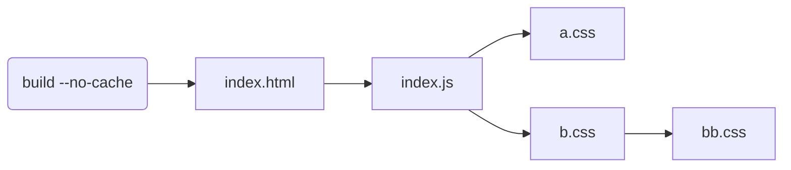
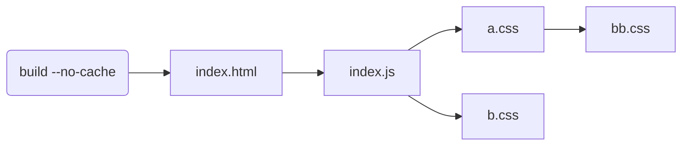
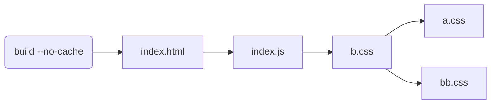
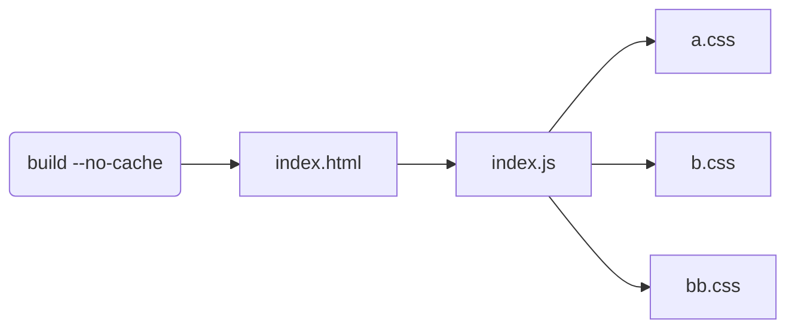
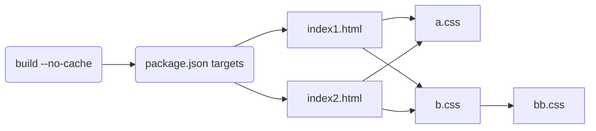

# Parcel crashes

```sh
$ yarn test
> $ yarn parcel build --no-cache ./src/index.html
🚨 Build failed.

@parcel/bundler-default: Expected content key d72cd18764f6518d to exist

  Error: Expected content key d72cd18764f6518d to exist
      at nullthrows
  (/node_modules/nullthrows/nullthrows.js:7:15)
      at ContentGraph.getNodeIdByContentKey
  (/node_modules/@parcel/graph/lib/ContentGraph.js:81:38)
      at getReachableBundleRoots
  (/node_modules/@parcel/bundler-default/lib/DefaultBundler.js:1161:44)
      at createIdealGraph
  (/node_modules/@parcel/bundler-default/lib/DefaultBundler.js:728:21)
      at Object.bundle
  (/node_modules/@parcel/bundler-default/lib/DefaultBundler.js:122:19)
      at BundlerRunner.bundle
  (/node_modules/@parcel/core/lib/requests/BundleGraphRequest.js:288:23)
      at async Object.run
  (/node_modules/@parcel/core/lib/requests/BundleGraphRequest.js:156:17)
      at async RequestTracker.runRequest
  (/node_modules/@parcel/core/lib/RequestTracker.js:756:20)
      at async Object.run
  (/node_modules/@parcel/core/lib/requests/ParcelBuildRequest.js:56:7)
      at async RequestTracker.runRequest
  (/node_modules/@parcel/core/lib/RequestTracker.js:756:20)

error Command failed with exit code 1.
```

```js
asset.id === 'd72cd18764f6518d'
asset.filePath === '..../src/bb.css'
```



---

## But it builds in a bunch of other cases








